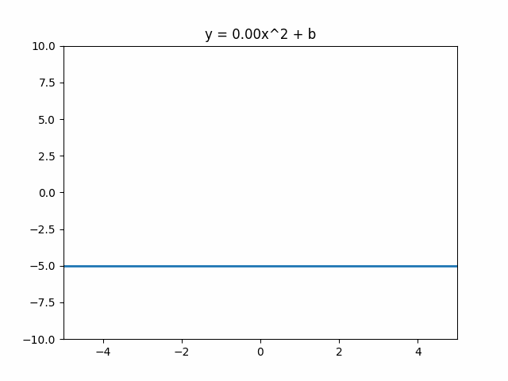

# Explosion

WeaponMechanics has a custom explosion system (We don't use the same code for TNT as most plugins do). This allows us to control every explosion aspect, like the shape and damage.&#x20;

If you are using WorldGuard, you can disable explosions in regions. Check out [#worldguard](../../addons.md#worldguard "mention") for more information.

```yaml
  Explosion:
    Knockback_Multiplier: <Double>>
    Explosion_Exposure: <Default/Distance/None>
    Explosion_Shape: <Sphere/Cube/Parabola/Default>
    Explosion_Type_Data:
      Yield: <Double>
      Radius: <Double>
      Angle: <Double>
      Depth: <Double>
      Width: <Double>
      Height: <Double>
      Rays: <Integer>
    Detonation:
      Delay_After_Impact: <Ticks>
      Remove_Projectile_On_Detonation: <true/false>
      Impact_When:
        Spawn: <true/false>
        Entity: <true/false>
        Block: <true/false>
    Cluster_Bomb:
      Split_Projectile: <ProjectileSerializer> 
      Projectile_Speed: <Double>
      Number_Of_Bombs: <Integer> 
      Number_Of_Splits: <Integer> 
      Detonation:
        Delay_After_Impact: <Ticks>
        Remove_Projectile_On_Detonation: <true/false>
        Impact_When:
          Spawn: <true/false>
          Entity: <true/false>
          Block: <true/false>
      Mechanics: <Mechanics>
    Airstrike:
      Dropped_Projectile: <ProjectileSerializer>
      Minimum_Bombs: <Integer> 
      Maximum_Bombs: <Integer>
      Height: <Double> 
      Vertical_Randomness: <Double> 
      Distance_Between_Bombs: <Double> 
      Maximum_Distance_From_Center: <Double>
      Layers: <Integer> 
      Delay_Between_Layers: <Integer>
      Detonation:
        Delay_After_Impact: <Ticks>
        Remove_Projectile_On_Detonation: <true/false>
        Impact_When:
          Spawn: <true/false>
          Entity: <true/false>
          Block: <true/false>
      Mechanics: <Mechanics>
    Block_Damage:
      Spawn_Falling_Block_Chance: 50%
      Drop_Broken_Block_Chance: 50%
      Damage_Per_Hit: <Integer>
      Default_Block_Durability: <Integer>
      Default_Mode: <CANCEL/BREAK/CRACK>
      Default_Mask: <Material>
      Blocks:
        - <Material*> <CANCEL/BREAK/CRACK*> <ShotsToBreakBlock> <Mask>
    Regeneration:
      Ticks_Before_Start: <Integer> 
      Max_Blocks_Per_Update: <Integer> 
      Ticks_Between_Updates: <Integer>
    Flashbang:
      Effect_Distance: <Double>
      Mechanics: <Mechanics>
    Mechanics: <Mechanics>
```

#### Knockback\_Multiplier

Controls how much knockback entities get from the explosion. Defaults to `1.0`. Set to `0.0` to disable knockback. Using numbers >1 will throw players faster and further.&#x20;

#### Explosion\_Exposure

An entity's exposure determines how much damage they take. Exposure is _challenging to calculate_ and involves ray tracing. To minimize potential lag, you may want to change this setting.



`Explosion_Exposure: DEFAULT`

This method is just like vanilla, but it uses the most CPU. Great for weapons that have a long reload time or otherwise aren't used often.&#x20;



`Explosion_Exposure: OPTIMIZED`

Similar to the DEFAULT method, but uses less ray tracing. Great choice for every server.&#x20;



`Explosion_Exposure: DISTANCE`

Works by calculating the distance between the entity and the center of the explosions. Since this method does not use ray tracing, it is very fast. This method is excellent for weapons that shoot very quickly and use small explosions.

Since this method does not use ray tracing, explosions can damage entities through walls.&#x20;



`Explosion_Exposure:  NONE`

The fastest method, applies 100% exposure to all entities within the explosion shape. This should almost never be used, since it will damage entities through walls with full damage, no matter how far away from the explosion's center they are.

This should only be used for tiny explosions. &#x20;



#### Explosion\_Shape

The shape of the blocks that are blown up. Each shape uses it's own "arguments" in `Explosion_Type_Data`. Check each shape for a simple example.&#x20;



Replicates a [vanilla explosion](https://minecraft.fandom.com/wiki/Explosion). Arguments:

* `Yield` -> The maximum distance from the center that blocks are broken.
  * For reference, `tnt=4`, `creeper=3`, `charged creeper=6`&#x20;
* `Rays` -> The number of ray casts for each direction. Defaults to 16.&#x20;
  * Increasing the number of rays may look better, but it costs more CPU.&#x20;

The following example creates a large explosion with increased detail.

```yaml
  Explosion:
    # Other args...
    Explosion_Shape: DEFAULT
    Explosion_Type_Data:
      Yield: 15.0
      Rays: 32
```


The `DEFAULT` explosion shape **cannot** destroy blocks that vanilla explosions can break. For example, obsidian and bedrock cannot be broken. If you want to damage these blocks, use another shape, like `SPHERE`.&#x20;




An explosion shaped like a sphere. Arguments:

* `Radius` -> The radius, in blocks, that blocks will be destroyed.&#x20;

The following example creates a sphere-shaped hole with a radius of 3 blocks.&#x20;

```yaml
  Explosion:
    # Other args...
    Explosion_Shape: SPHERE
    Explosion_Type_Data:
      Radius: 3.0
```



An explosion shaped like a large rectangle. Arguments:

* `Width` -> The width, in blocks, of the rectangle.
* `Height` -> The height, in blocks, of the rectangle.&#x20;

The following example creates a 5x5 cube explosion.

```yaml
  Explosion:
    # Other args...
    Explosion_Shape: CUBE
    Explosion_Type_Data:
      Width: 5.0
      Height: 5.0
```



An explosion shaped like a parabola. Arguments:

* `Angle` -> The steepness of the parabola.&#x20;
  * `0.5` is a good number for small explosions.
  * Check out the GIF below for example.&#x20;
* `Depth` -> The height, in blocks, of the rectangle.&#x20;
  * This should be a negative number, like `-5`.

<figure><figcaption><p>Shows an animation for different Angle values</p></figcaption></figure>

The following example creates a medium explosion 5 blocks deep.

```yaml
  Explosion:
    # Other args...
    Explosion_Shape: PARABOLA
    Explosion_Type_Data:
      Angle: 0.5
      Depth: -5.0
```



#### Detonation

Determines when the explosion triggers. For a Molotov, you probably want it to explode on impact. But for a frag, you probably want it to explode a fixed time after you throw it.&#x20;

* `Delay_After_Impact`
  * The delay, in ticks, between the "impact" and the explosion.&#x20;
* `Remove_Projectile_On_Detonation`
  * Use `true` to remove the projectile after the explosion.&#x20;
* `Impact_When`
  * `Spawn` -> Triggers after spawning. Good for frags.
  * `Entity` -> Triggers after hitting an entity.
  * `Block` -> Triggers after hitting a block.

The following example will cause the explosion 5 seconds (100 ticks) after shooting the projectile.&#x20;

```yaml
  Explosion:
    # Other args...
    Detonation:
      Delay_After_Impact: 100
      Remove_Projectile_On_Detonation: true
      Impact_When:
        Spawn: true
```

#### Cluster\_Bomb

Cluster bombs use recursion, which means that explosions spawn projectiles, which spawn explosions (and so on).

* `Split_Projectile`
  * Uses the [projectile](../projectile/ "mention") serializer.
  * Defaults to the projectile used for the gun.&#x20;
* `Projectile_Speed`
  * The speed, in $$\frac{m}{s}$$, that the projectile should spawn with.&#x20;
  * Defaults to `30`.
* `Number_Of_Bombs`
  * The number of projectiles to spawn for each explosion.&#x20;
* `Number_Of_Splits`
  * The number of iterations.&#x20;
  * For most use cases, this number should be `1`.&#x20;
* `Detonation`
  * Same as [#detonation](./#detonation "mention"), but now used for new projectiles.
* `Mechanics`
  * The mechanics to trigger whenever a split occurs (good for playing a sound to warn players of the split).
  * See the [Mechanics](https://app.gitbook.com/o/MgHAZkcfIhs3YcmBjk2r/s/hz7yMxlL81NxAT44nraH/ "mention") wiki.
  * `@Source{}` -> The shooter of the weapon
  * `@Target{}` -> The split location (not an entity).

#### Airstrike

Drops projectiles from the sky, good for flare guns.&#x20;

* `Dropped_Projectile`
  * Uses the [projectile](../projectile/ "mention") serializer.
  * Defaults to the projectile used for the gun.
* `Minimum_Bombs`
  * The minimum number of bombs to drop
* `Maximum_Bombs`
  * The maximum number of bombs to drop.
* `Height`
  * How high up to drop the bombs from
  * Defaults to 60 blocks
* `Vertical_Randomness`
  * Adds some randomness, so bombs explode at different times.
  * Defaults to `5.0` (airstrike location can vary by 10 blocks).
* `Distance_Between_Bombs`
  * The minimum distance between dropped bombs.
  * Defaults to `3.0` blocks.&#x20;
* `Maximum_Distance_From_Center`
  * Defines how far away (horizontally) the bombs can drop.
  * Defaults to `25.0` block radius.&#x20;
* `Layers`
  * Repeats the airstrike.
  * Defaults to `1`.
* `Delay_Between_Layers`
  * The delay, in ticks, between repetitions.&#x20;
  * Defaults to `40` ticks
* `Detonation`
  * Same as [#detonation](./#detonation "mention"), but used for the dropped bombs.
* `Mechanics`
  * The mechanics to trigger  whenever an airstrike spawns. Great for playing a "bombs away" sound.
  * Use the [Mechanics](https://app.gitbook.com/o/MgHAZkcfIhs3YcmBjk2r/s/hz7yMxlL81NxAT44nraH/ "mention") wiki.
  * `@Source{}` -> The shooter of the airstrike.
  * `@Target{}` -> The location of the projectile (not an entity).

#### Block\_Damage

Check out our [block-damage.md](block-damage.md "mention") wiki for information!

#### Regeneration

Used together with the `Block_Damage` feature. This regenerates blocks over time.&#x20;


Regeneration isn't _perfect_. Anything that causes block updates (players breaking blocks, redstone loops, pistons, some entities, etc.) can cause regeneration issues.

Hopper-reliant systems, like item sorters, are almost guaranteed to break during regeneration. Protect your regions using [#worldguard](../../addons.md#worldguard "mention").


* `Ticks_Before_Start`
  * The time, in ticks, before the first blocks begin to regenerate.
* `Max_Blocks_Per_Update`
  * How many blocks to regenerate for each update.
* `Ticks_Between_Updates`
  * The time, in ticks, between regenerations.

#### Flashbang

Let's you execute mechanics on people who are looking at the explosion.&#x20;

* `Effect_Distance`
  * The maximum distance away an entity should be to be safe.
* `Mechanics`
  * The mechanics to trigger on each victim.
  * Use the [Mechanics](https://app.gitbook.com/o/MgHAZkcfIhs3YcmBjk2r/s/hz7yMxlL81NxAT44nraH/ "mention") wiki.
  * `@Source{}` the shooter of the weapon.
  * `@Target{}` the victim who was flash banged.

The following example will blind all players affected by the flashbang:

```yaml
  Explosion:
    # Other args...
    Flashbang:
      Effect_Distance: 10.0
      Mechanics:
        - "Potion{potion=BLINDNESS} @Target{}"
```

#### Mechanics

Mechanics to trigger when the explosion occurs. Used to play an explosion sound usually.&#x20;

* `@Source{}` -> The shooter of the weapon.
* `@Target{}` -> The location of the explosion (not an entity).

***

## Explosion Example

This explosion breaks a few specific blocks (see below) in a 5.5-block radius. Blocks begin to regenerate after 2 minutes.

Bedrock, obsidian, and netherite cannot be damaged. Any material with "glass" in its name is broken in 2 shots, except for any material with "glass\_pane" in the name, which can be broken in 1 shot. Any material with "wood" in the name can be broken in 6 shots, and dirt can be broken in 4 shots. All other materials cannot be broken, but they appear to take 12 shots of damage and show the crack animation. 10 seconds after a block is broken, it is regenerated.

```yaml
  Explosion:
    Explosion_Exposure: DEFAULT
    Explosion_Shape: SPHERE
    Explosion_Type_Data:
      Radius: 5.5
    Block_Damage: 
      Spawn_Falling_Block_Chance: 20% 
      Default_Block_Durability: 12
      Default_Mode: CRACK
      Blocks:
        - bedrock CANCEL
        - obsidian CANCEL
        - netherite_block CANCEL
        - $glass BREAK 2
        - $glass_pane BREAK 1
        - $wood BREAK 6
        - dirt BREAK 4
    Regeneration:
      Ticks_Before_Start: 2400 
      Max_Blocks_Per_Update: 4
      Ticks_Between_Updates: 5
```


Notice how `$glass_pane` is below `$glass$`. This is because **order matters**. When using the wildcard character `$`, make sure to use the "more general blocks" (Like any glass block) **before** the "more specific blocks" (Like any glass pane).&#x20;

